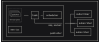

# Hyper

[Hyper][hyper] is a high-concurrency task scheduling system built for scraping
bike-sharing networks using [pybikes]. Network updates are published over a
ZeroMQ PUB socket, allowing external components to subscribe to live data
updates.


<figure>
  <div>
    
    <figcaption>hyper pub/sub model</figcaption>
  </div>
</figure>

[hyper]: https://github.com/citybikes/hyper
[pybikes]: /pybikes

### hyper :: publisher

The publisher is the primary component of the system. It's highly configurable
and allows for fine grained control over scrape intervals and settings. Each
network update is a task, that gets scheduled on fixed intervals. On success,
each task publishes the result to any connected subscribers. The scheduler
leverages python's asyncio framework for concurrent execution of tasks using
queues and workers. Additionally, it uses [APScheduler] to enqueue tasks.

[APScheduler]: https://pypi.org/project/APScheduler/

### hyper :: subscriber

Subscribers are independent components that connect to the scheduler’s ZeroMQ
socket, receive messages, and perform actions based on the received data. As an
example, a subscriber could be storing this information on a database and then
serving it through an API, and another subscriber could be monitoring a single
network.

## Getting started

### Installation

```shell
pip install citybikes-hyper
```

### Usage

Start a publisher

```shell
$ hyper publisher
...
15:40:09 | INFO | [velitul] stations 6
15:40:09 | INFO | [velitul] Publishing network:Cykleo:velitul:update
15:40:09 | INFO | [idecycle] stations 14
15:40:09 | INFO | [idecycle] Publishing network:Cykleo:idecycle:update
15:40:09 | INFO | [twisto-velo] stations 21
15:40:09 | INFO | [twisto-velo] Publishing network:Cykleo:twisto-velo:u...
15:40:09 | INFO | [nextbike-leipzig] stations 122
15:40:09 | INFO | [nextbike-leipzig] Publishing network:Nextbike:nextbi...
```

Start a logging subscriber

```shell
$ hyper subscriber
15:40:59.916 | INFO | Waiting for messages on tcp://127.0.0.1:5555/#
15:41:03.498 | INFO | #network:Cykleo:velitul:update: {"tag": "velit ...
15:41:03.526 | INFO | #network:Cykleo:twisto-velo:update: {"tag": ...
```

Logging is all fun, but let's now do something with the information.

See [examples/sqlite_subscriber.py] for an example implementation of a
subscriber that stores produced information on a local SQLite database.

```shell
$ python examples/sqlite_subscriber.py
16:44:03.629 | INFO | Waiting for messages on tcp://127.0.0.1:5555/#
16:44:10.712 | INFO | Processing {'name': 'Vélitul', 'city': 'Laval', ...
16:44:10.714 | INFO | [velitul] Got 6 stations
16:44:10.715 | INFO | [velitul] Finished processing 6 stations
16:44:10.728 | INFO | Processing {'name': 'IDEcycle', 'city': 'Pau', ...
16:44:10.728 | INFO | [idecycle] Got 14 stations
16:44:10.729 | INFO | [idecycle] Finished processing 14 stations
```

```shell
$ sqlite3 citybikes.db
SQLite version 3.43.2 2023-10-10 13:08:14
Enter ".help" for usage hints.
sqlite> select count(*) from networks;
674
sqlite> select count(*) from stations;
70735
sqlite>
```

[examples/sqlite_subscriber.py]: https://github.com/citybikes/hyper/blob/master/examples/sqlite_subscriber.py


## Configuration

The publisher is highly configurable and allows for fine grained control over
scrape intervals and settings. The configuration file is written in python and
is either set with an environment variable or as an argument to the publisher.

Using an environment variable

```shell
$ HYPER_CONFIG=config.py hyper publisher
```

As a command line argument

```shell
$ hyper publisher -c config.py
```

#### Example configuration

```python

from hyper.config import Config
from hyper.publisher import DEFAULTS

schedule = Config(DEFAULTS, {
    # Run updates every 3 minutes
    ".*": {
        "interval": 180,
    },
    # Set a different interval for all GBFS networks
    "pybikes.gbfs::.*": {
        "interval": 300,
    },
    # The following changes only affects network with tag 'citi-bike-nyc'
    "pybikes.gbfs::citi-bike-nyc": {
        # add a 10s jitter between scheduled requests
        "jitter": 10,
        # scraper opts for this network
        "scraper": {
            "user-agent": "Agent 700",
            "requests_timeout": 42,
        }
    },
    "pybikes.nextbike::.*": {
        # use a different queue for nextbike
        "queue": "nextbike",
    }
})

queues = [
    # Default queue with 100 workers
    ("default", 100),
    # Use 50 workers on this queue
    ("nextbike", 50),
]
```


### Syntax

#### Schedule

The schedule uses pattern matching on pybikes instance signatures. For example
`pybikes.gbfs::citi-bike-nyc` matches a GBFS network instance with the tag
`citi-bike-nyc`, `pybikes.gbfs::.*` matches all GBFS networks and `.*` matches
any pybikes instance.

Entries are declared with key-values, the key is the pattern match and the value
the schedule configuration for all matches.

```
{
    pattern-match: entry,
    pattern-match: entry,
    ...
}
```

Each entry defines the settings that apply to matching instances.

```python
{
    "enabled": True,
    # update interval in seconds: int
    "interval": 180,
    # add a random component to execution time
    "jitter": 0,
    # set run concurrency
    "concurrency": {
        # per network (for async networks)
        "network": 20,
        # whole system (number of concurrent networks of this class)
        "system": None,
    },
    "scraper": {
        "requests_timeout": 11,
        "retry": False,
        "retry_opts": {},
        "proxy_enabled": False,
        "ssl_verification": True,
        "proxies": {
            "http": "http://%s:%s" % (PROXY_HOST, PROXY_PORT),
            "https": "http://%s:%s" % (PROXY_HOST, PROXY_PORT),
        },
    },
}
```

##### Enabled

> default: True

Enable or disable matching instances.

##### Interval

> default: 180

The update interval, in seconds.

##### Jitter

> default: 0

Add a random jitter to update interval, in seconds.

##### Concurrency

> default: `{"network": 20, "system": None}`

Limit the number of requests to specific endpoints by setting concurrency limits
to either a single network instance or the whole system class.

Limits apply to single `network` instances that are of the `async` type, meaning
that there are multiple requests to be done to get the full network updated.
Limits set to a `system` will make it so there's a maximum of n concurrent
requests for that system.

This setting is useful to make sure respectful limits can be enforced on
endpoints, but note that setting `system` limits will cause workers to take the
task and wait for other workers to complete before running their own task. This
setting is also useful for systems that use caching, so the best way to ensure
only one request is done is by setting it to 1.

##### Scraper

> default:
> ```
> {
>       "user_agent": f"pybikes - hyper {version}",
>       "requests_timeout": 11,
>       "retry": False,
>       "retry_opts": {},
>       "proxy_enabled": False,
>       "ssl_verification": True,
>       "proxies": {
>           "http":  "http://%s:%s" % (PROXY_HOST, PROXY_PORT),
>           "https": "http://%s:%s" % (PROXY_HOST, PROXY_PORT),
>       },
> }
> ```

Initialization arguments passed to [PyBikesScraper][scraper]. These settings
will be used to initialize the scraper on each instance update.

[scraper]: https://github.com/eskerda/pybikes/blob/master/pybikes/utils.py#L16-L33

#### Queues and workers

Setting up queues and workers is useful for distributing resources as needed. If
none are specified, it uses a single queue named `default` with 100 workers.

Queues and workers are set by pairs of `("name", n_workers)`. Workers can be
assigned to multiple queues by using a list of names. The following example uses
two queues (`queue_1` and `queue_2`), with 10 workers assigned to `queue_1`, 20
to `queue_2`, and 30 to both `queue_1` and `queue_2`.

```python
queues = [
    ("queue_1", 10),
    ("queue_2", 20),
    (["queue_1", "queue_2"], 30)
]
```

To schedule tasks on a particular queue, configure it using schedule entries.

```python
schedule = Config(DEFAULTS, {
    ".*": {
        "queue": "default",
    },
    "pybikes.nextbike::.*": {
        "queue": "nextbike"
    }
})

queues = [
    # Default queue with 100 workers
    ("default", 100),
    # Dedicated 50 workers for nextbike
    ("nextbike", 50),
]

```

## Implementing a subscriber

Subscribers are language agnostic and can be implemented in any language that
parses json and has bindings for zmq.

For python, the logging subscriber can be subclassed to create custom
subscribers by extending the `handle_message` method.

```python
import json
import argparse

from hyper import ZMQSubscriber

ZMQ_ADDR = os.getenv("ZMQ_ADDR", "tcp://127.0.0.1:5555")
ZMQ_TOPIC = os.getenv("ZMQ_TOPIC", "")

class ExampleSubscriber(ZMQSubscriber):
    def handle_message(self, topic, message):
        # Do something with the network
        network = json.loads(message)
        # ...


if __name__ == "__main__":
    parser = argparse.ArgumentParser()
    parser.add_argument("-a", "--addr", default=ZMQ_ADDR)
    parser.add_argument("-t", "--topic", default=ZMQ_TOPIC)
    args, _ = parser.parse_known_args()
    subscriber = ExampleSubscriber(args.addr, args.topic)
    subscriber.reader()
```
